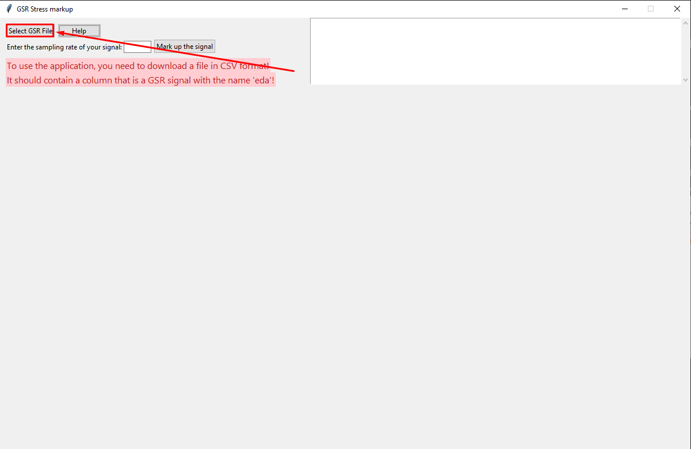
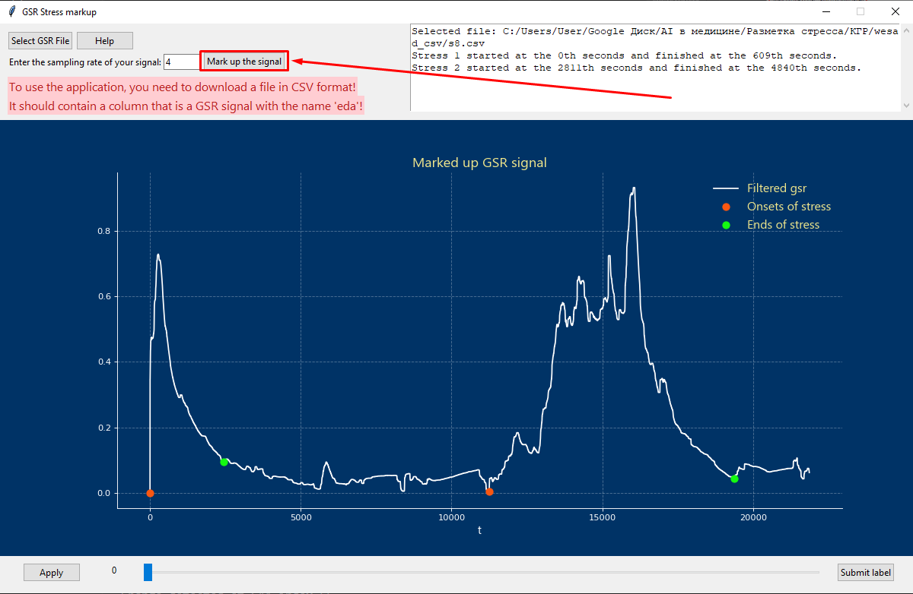

# Marking the GSR signal for stress
An application based on the tkinter library that allows you to mark up the GSR signal for stress, display the graph along with the markup, and also apply your own markup to the signal.

## Installing the app and getting started
1. git clone https://github.com/V1xtor/gsr-stress-app
2. pip install -r requirements.txt
3. python -W ignore interface.py

## How do I use the app?
First, you need to download the file with the GSR signal (after that, the raw data will be sent to the server):

Then you need to enter the sampling rate of your signal:

And click the «Markup» and «Plot» buttons (after that, the array of labels will be sent to the server):

Then, using the slider at the bottom and the corresponding buttons, you can add your own markup to the graph. To do this, place the slider in the right place and click the «Apply» button — the label will be placed on the chart, but not saved. To save the label, click the «Submit» button. All saved tags will be sent to the server.
